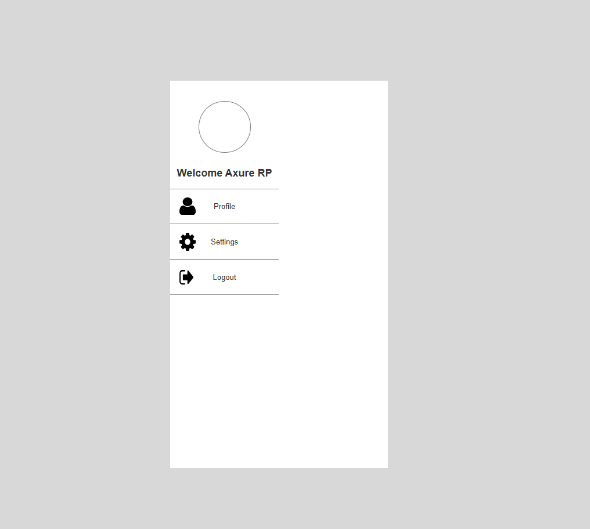

# Day06-Practicals

## Swipe Activated Side Menu

This repository documents the Day 06 practical session for **IT3213 Human Computer Interaction (HCI)**, focusing on building a single-page interface with a swipe-activated side menu in Axure RP 9.

---

## Practical Overview 🚀

The goal of this session is to implement a single-page interface featuring a swipe-activated side menu.

---

## Day 06 Progress

### Page 01: 🔝

**Menu Structure:**

- Dynamic Panel anchored to the left edge.

**Trigger Menu:**

- Swipe Left: Expands menu (left side of screen).

**Close Menu:**

- Click Profile/Settings: Instantly collapses menu.

**Animations:**

- Slide-in duration: 200ms (ease-in-out).

---

##Screenshots

## How to Use the Axure RP 9 File 📂

1. Download and install Axure RP 9 if you haven't already.
2. Open the `.rp` file provided in this repository.
3. Navigate through the pages using the Page Navigator in Axure RP 9.
4. Preview the prototype by clicking the **Preview** button to see the interactions in action.

---

## Hosted Project on Axure Cloud ☁️

The project is hosted on Axure Cloud for easy access and interaction.  
You can view the live prototype by clicking the link below:

🔗 [https://jvhnvu.axshare.com](#)

---

## License 📜

This project is licensed under the MIT License. See the [LICENSE](LICENSE) file for details.
